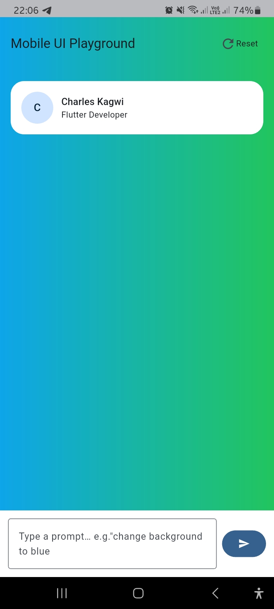
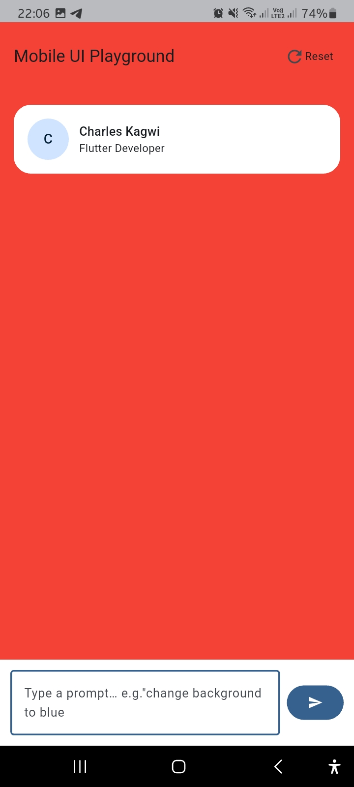
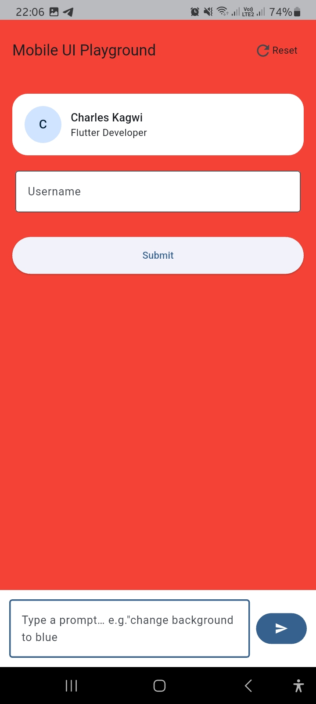

# 📱 LLMApp - Mobile UI Playground

A Flutter app that showcases how users can **dynamically update UI properties** through **natural language prompts**.  
The app parses user instructions into structured layout commands and applies them in real-time.

---

## ✨ Features

- 🖌️ Change background color with a simple text prompt
- 📝 Update the app title dynamically
- 👤 Show a profile card with name and role
- 🔑 Add form fields like **email**, **username**, and **password**
- 🔘 Add buttons such as **Submit**
- ♻️ Reset the entire UI to its initial state

---

## 🚀 Getting Started

### 1. Prerequisites
- [Flutter SDK](https://docs.flutter.dev/get-started/install) (≥ 3.8.1)
- Android Studio / VS Code with Flutter & Dart plugins
- Android SDK / Xcode (for iOS builds)
- Gradle 8.9 (already managed by `gradle-wrapper.properties`)

### 2. Clone the repository
```bash
git clone https://github.com/kagwicharles/LLM-Powered-Flutter-App.git
cd llmapp
```

## 📸 Screenshots
<p align="center">
  
  
  
</p>

